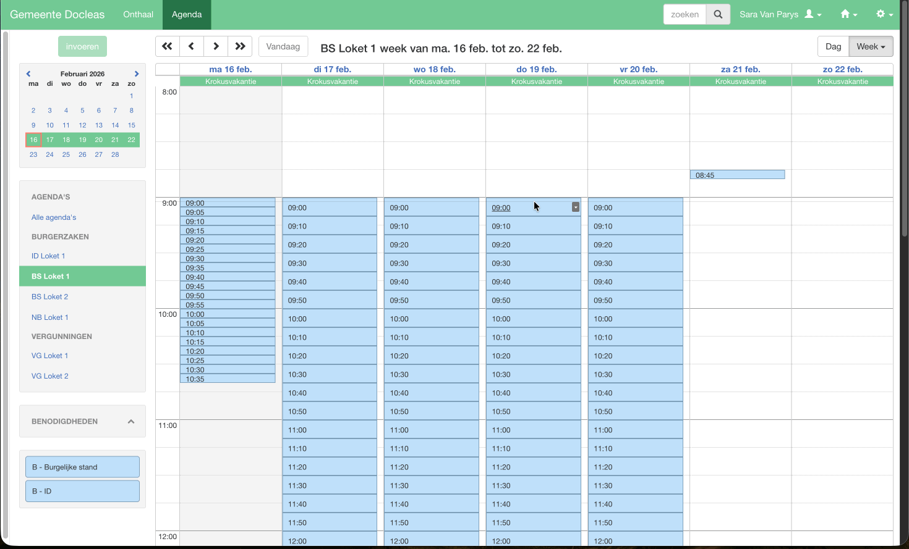

# Producten - Structuur

## Overzicht

De **structuurpagina** geeft een visueel overzicht van welke producten beschikbaar zijn per agenda. Dit is een krachtig controlemiddel om te verifiëren dat je producten correct gekoppeld zijn aan de juiste agenda's.

## Waarom de structuurpagina gebruiken?

De structuurpagina helpt je om:

- **Te controleren** of alle agenda's gekoppeld zijn aan de juiste beschikbaarheden, groepen en producten
- **Te verifiëren** of de burgerflow de correcte tussenstappen bevat
- **Overzicht te krijgen** van de volledige productstructuur van de gemeente

## Toegang

1. Log in op de applicatie
2. Navigeer naar **Producten** > **Structuur**



## Inhoud van de structuurpagina

### Agenda's
De structuurpagina toont een hiërarchische weergave van de agenda's:

```
📅 Agenda: Loket Burgerlijke Stand
    └─ 📄 Beschikbaarheid: Burgerlijke stand
        └─ 📄 Groep: Identiteit
            ├─ 📄 Identiteitskaart aanvragen
            ├─ 📄 Paspoort aanvragen
            └─ 📄 Geboorteakte

📅 Agenda: Niet Belgen
    └─ 📄 Beschikbaarheid: Niet Belgen
        ├─ 📄 Identiteitskaart aanvragen
        ├─ 📄 Paspoort aanvragen
        └─ 📄 Geboorteakte

```

### Elementen in de agenda structuur


**Agenda's** (bovenste niveau)
- Alle agenda's

**Beschikbaarheden** (tweede niveau)
- Alle beschikbaarheden die aan de agenda gekoppeld zijn

**Groepen** (derde niveau)
- Alle groepen onder de beschikbaarheden

**Producten** (Laagste niveau)
- Alle producten onder de groepen


Groepen zijn niet verplicht, producten kunnen ook rechtrstreeks onder de beschikbaarheden hangen.

### Publieke tegels
De structuurpagina toont ook alle tegels en de onderliggende structuur.

```
📄 Tegel (Groep): Belgen
    ├─ 📄 Groep: Identiteit
    |   ├─ 📄 Identiteitskaart aanvragen
    |   ├─ 📄 Paspoort aanvragen
    |   └─ 📄 Geboorteakte
    └─ 📄 Groep: Attesten
        └─ 📄 Attest van woonst aanvragen

📄 Tegel (Groep): Niet Belgen
    ├─ 📄 Groep: Identiteit
    |   ├─ 📄 Identiteitskaart aanvragen
    |   └─ 📄 Paspoort aanvragen
    └─ 📄 Belgische nationaliteit aanvragen

```

### Elementen in de tegelstructuur


**Tegels** (bovenste niveau)
- Alle tegels in de burgerflow, dit kunnen groepen of producten zijn

**Groepen** (tweede niveau)
- Alle groepen (in groepen), groepen kunnen meerdere niveaus bevatten. Het aantal niveaus kan je zelf bepalen. Beter een niveau extra dan teveel tegels op 1 scherm.


**Producten** (Laagste niveau)
- Alle producten onder de groepen. Probeer het zo in te stellen zodat de burger makkelijk zijn product kan terugvinden.


## Navigatie

- [Terug naar handleiding dienstbeheerders](../index.md)
- [Vorige: Groepen](groepen.md)
- [Volgende: Overzichtspagina](overzichtspagina.md)

---

*Laatst bijgewerkt: 16 februari 2026*
