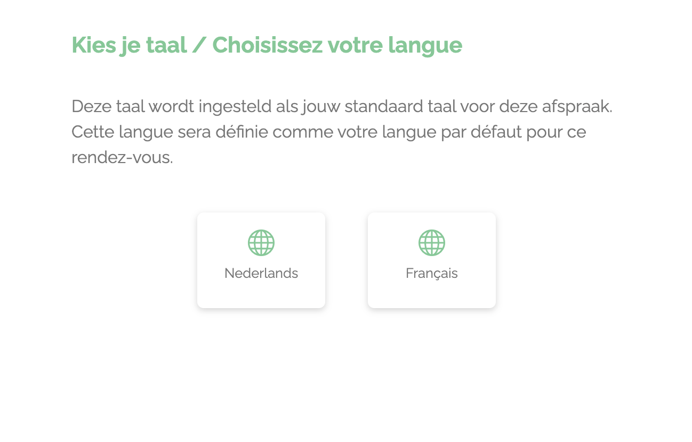
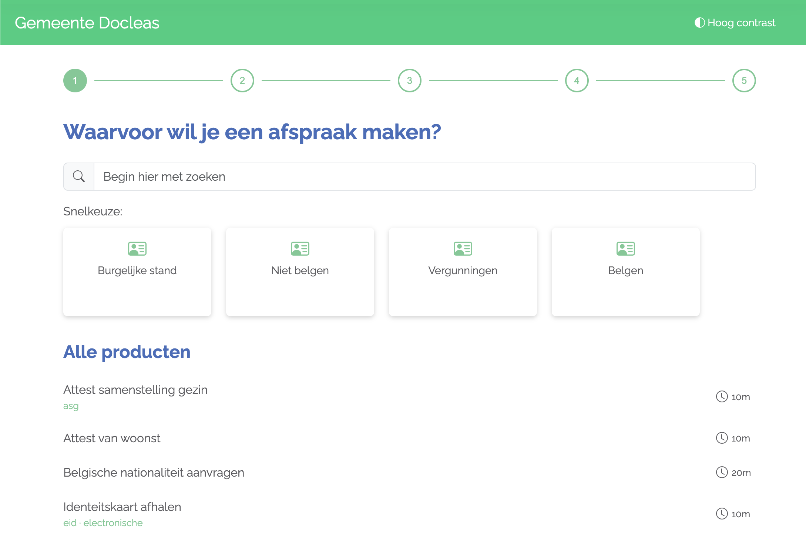
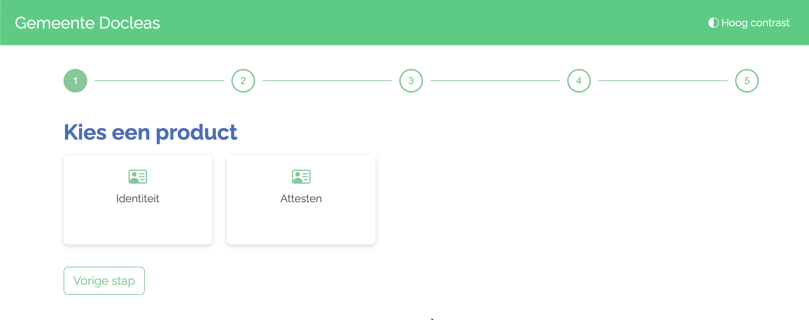
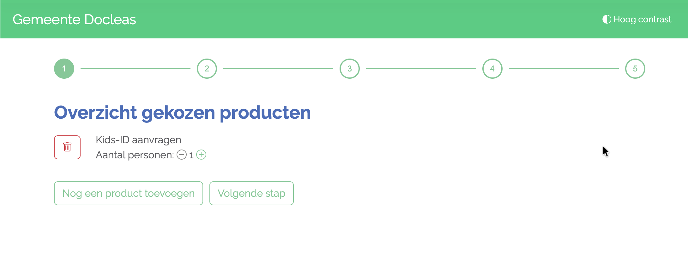
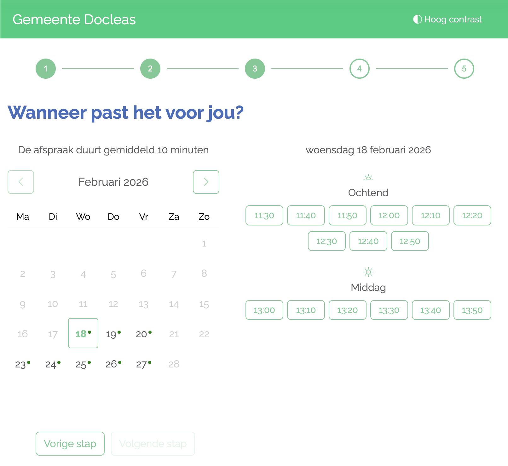
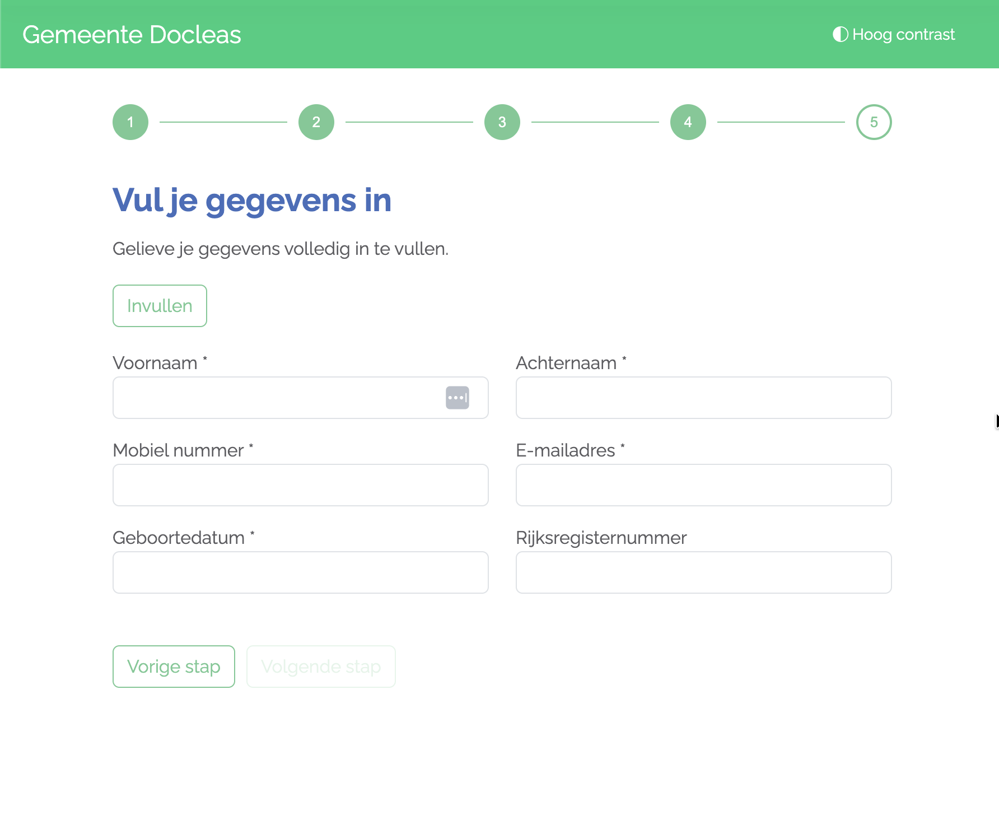
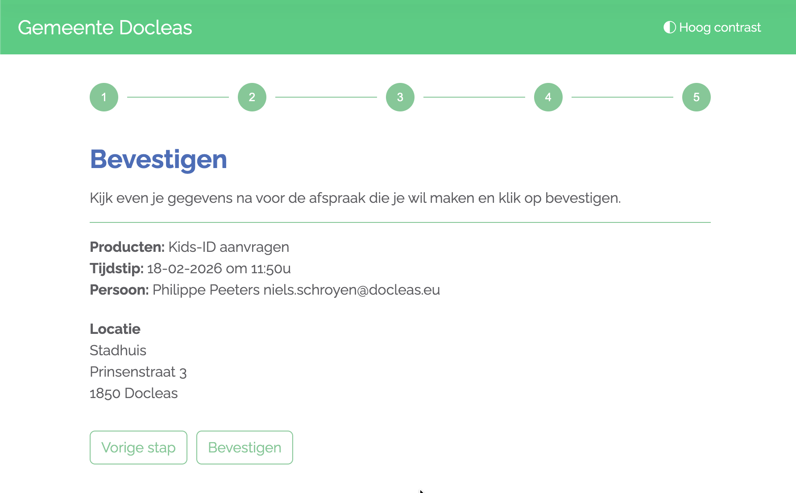

# De Burgerflow - Werking en configuratie

## Overzicht

De Burgerflow is ontworpen om zo laagdrempelig mogelijk te zijn:

- Geen login vereist
- Werkt op elk apparaat
- Stappen worden overgeslagen als ze niet van toepassing zijn
- Communicatie verloopt automatisch in de taal van de burger
- Producten kunnen worden gecombineerd in één afspraak

De flow past zich aan aan je configuratie. Hoe meer je instelt, hoe meer de burger zelfstandig kan regelen.

Dit document beschrijft welke stappen een burger doorloopt en hoe jij als lokaal bestuur elke stap kunt instellen.

## Demo: een burger maakt een afspraak

<Video
  src="https://assets-acc.doclr.be/docleas-assets/documentation/videos/burger-maakt-afspraak-demo.mp4"
  title="Een burger maakt een afspraak via de Burgerflow"
/>

## Stappen in de Burgerflow

De Burgerflow bestaat uit maximaal 7 stappen. Afhankelijk van je configuratie worden sommige stappen overgeslagen.

### Stap 1: Taalkeuze

Standaard is er geen taalkeuze. Dit is enkel relevant voor **faciliteitengemeenten**.

Als meertalige ondersteuning ingeschakeld is, dan kiest de burger hier de taal voor de rest van de flow. Ook de communicatie zoals e-mails en sms-berichten zullen in deze taal worden verstuurd.

**Configuratie**

Als je vragen hebt over de beschikbare talen of opmerkingen over de teksten doorheen de burgerflow dan mag je dat laten weten via support.

> Als jouw lokaal bestuur slechts één taal gebruikt, wordt deze stap overgeslagen.

---

### Stap 2: Productkeuze

De burger ziet een snelkeuze van producten of diensten, ook wel **tegeltjes** genoemd. 
Onder de tegeltjes kan de burger ook zoeken naar een specifiek product. Er wordt gezocht in zowel de naam als in de synoniemen. 
Onder het zoekveld heb je ook de mogelijkheid om alle producten te tonen. Om deze instelling aan te passen neem je contact op met support.

Als de burger een **groepstegeltje** kiest dan worden alle producten van deze groep getoond.

Na het selecteren van een product dan komt de burger op de productoverzichtspagina terecht. Hier heeft de burger de keuze om het aantal personen te selecteren of nog een product toe te voegen. Producten in dezelfde beschikbaarheid kunnen worden gecombineerd. 
> Als het door één loket of medewerker kan worden afgehandeld dan kunnen producten worden gecombineerd.

Afhankelijk van de configuratie kan de burger één of meerdere producten tegelijk selecteren. Producten kunnen gegroepeerd worden weergegeven.

**Configuratie**
- [Producten beheren](../producten/producten-beheren.md) - Producten aanmaken en beheren
- [Productgroepen](../producten/groepen.md) - Producten organiseren in groepen
- [Overzichtspagina](../producten/overzichtspagina.md) - Alle producten beheren in één overzicht

---

### Stap 3: Productinformatie

Na het kiezen van een product toont de flow extra informatie: een beschrijving, benodigde documenten, kosten of andere relevante informatie die jij instelt. De teksten kun je zelf bepalen en uitbreiden met de teksten uit de LPDC. De burger heeft ook de mogelijkheid om deze informatie af te drukken via een printknop.

**Configuratie**
- [Teksten beheren](../producten/teksten.md) - Uitleg over het beheren van teksten

---

### Stap 4: Locatiekeuze

Als de gekozen producten mogelijk zijn op meerdere locaties dan kan de burger een locatie kiezen.

**Configuratie**
- Locaties worden beheerd via [Agenda's](../agendas.md).

> Als jouw lokaal bestuur slechts één locatie heeft, wordt deze stap overgeslagen.

---

### Stap 5: Tijdstipkeuze

De burger ziet een kalenderoverzicht met beschikbare tijdsloten voor het gekozen product en de gekozen locatie. Bezette tijdsloten zijn niet meer zichtbaar.

**Configuratie**
De beschikbare tijdsloten worden bepaald door:
- [Werkschema's](../werkschemas/index.md) - Wanneer loketten en medewerkers beschikbaar zijn
- [Producten - Beschikbaarheden](../producten/beschikbaarheden.md) - Voor welke periodes een product boekbaar is

---

### Stap 6: Gegevens invullen

De burger vult de gevraagde persoonsgegevens in. Welke velden verplicht of zichtbaar zijn, bepaal je per product.

**Configuratie**
- Configureer de velden via [Producten - Velden](../producten/velden.md).

---

### Stap 7: Bevestiging

De burger krijgt een samenvatting van de afspraak te zien: gekozen product(en), datum, tijdstip, locatie en contactgegevens. Na het bevestigen ontvangt de burger een bevestigingsmail.

**Configuratie**
De inhoud van de bevestigingsmail stel je in via [Gemeente-instellingen](../gemeente-instellingen.md).

---

## Overzicht: configuratie per stap

| Stap | Configuratie |
|------|-------------|
| Taalkeuze | [Gemeente-instellingen](../gemeente-instellingen.md) |
| Productkeuze | [Producten beheren](../producten/producten-beheren.md), [Groepen](../producten/groepen.md) |
| Productinformatie | [Producten - Teksten](../producten/teksten.md) |
| Locatiekeuze | [Agenda's](../agendas.md) |
| Tijdstipkeuze | [Werkschema's](../werkschemas/index.md), [Beschikbaarheden](../producten/beschikbaarheden.md) |
| Gegevens invullen | [Producten - Velden](../producten/velden.md) |
| Bevestiging | [Gemeente-instellingen](../gemeente-instellingen.md) |

---

*Laatst bijgewerkt: 18 februari 2026*
