# Werkschema's beheren

## Overzicht

Een **werkschema** bepaalt wanneer een agenda beschikbaar is en voor welke producten. Het is de brug tussen agenda's en beschikbaarheden: zonder werkschema zijn er geen vrije sloten en kunnen burgers dus geen afspraken maken. Het werkschema is een uitgebreide vorm van openingsuren.

Per agenda kun je één of meerdere werkschema's aanmaken. Elk werkschema heeft een startdatum en bestaat uit één of meerdere weken. Binnen elke week stel je per dag in welke tijdsloten beschikbaar zijn en voor welke beschikbaarheid.

Werkschema's worden beheerd via **Werkschema** in de agenda applicatie.

> Op elke gegeven moment is er exact een werkschema actief.

---

## Werkschema's

Op de werkschema pagina zie je links een overzicht van alle agenda's. Onder elke agendanaam staat de startdatum van het bijbehorende werkschema.

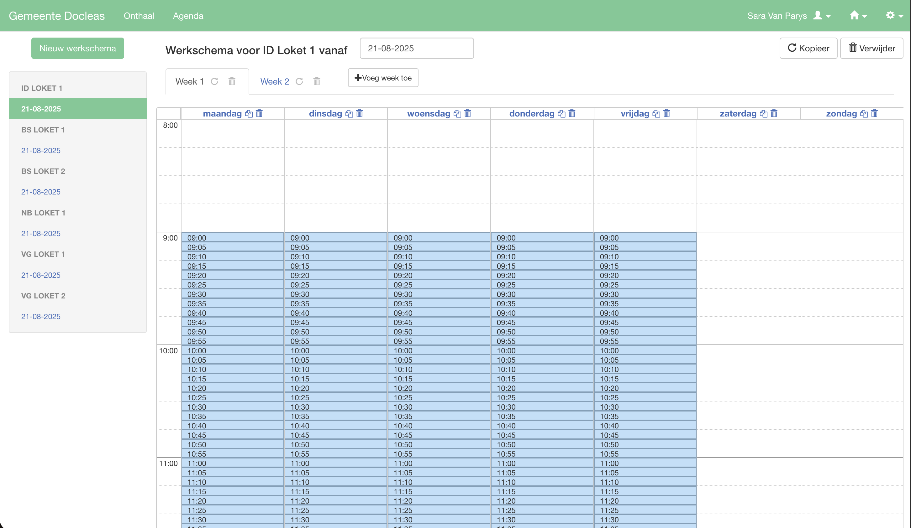

Klik op een datum in de linkerzijbalk om het werkschema van die agenda te bekijken en te bewerken. Het geselecteerde werkschema wordt in kleur§ gemarkeerd.

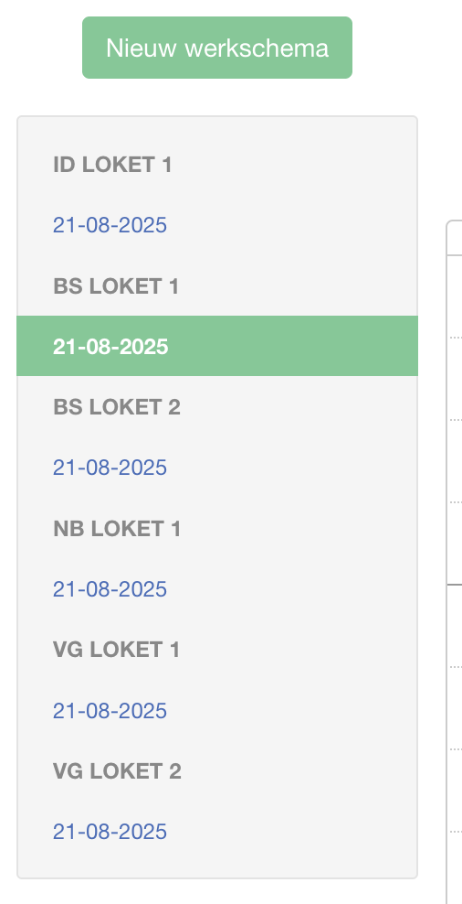

In het hoofdgedeelte zie je:
- De naam van de agenda en de startdatum van het werkschema
- Tabs voor elke week (Week 1, Week 2, ...)
- Een weekkalender met per dag de ingestelde tijdsloten

---

## Nieuw werkschema aanmaken

Klik op **Nieuw werkschema** bovenaan de linkerzijbalk om een werkschema aan te maken voor een agenda.

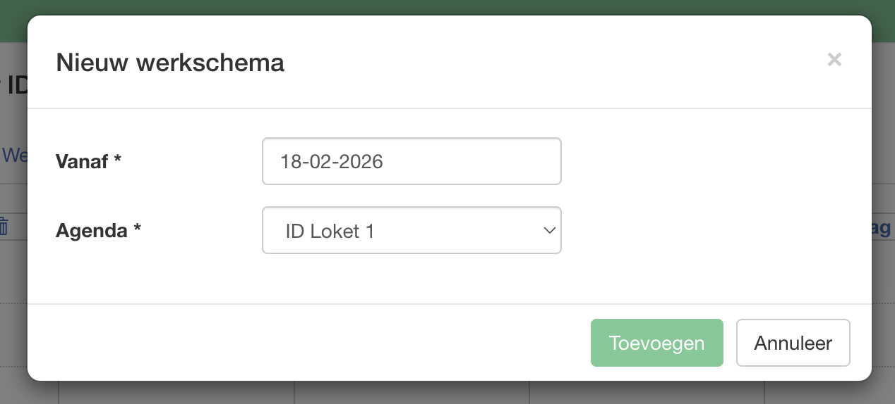

Klik op **Toevoegen** om het werkschema aan te maken. Het nieuwe werkschema verschijnt daarna in de lijst aan de linkerzijde.

> Een agenda kan meerdere werkschema's hebben met verschillende startdata. Het systeem past automatisch het juiste werkschema toe op basis van de datum van de afspraak.

---

## Werkschema kopiëren

Je kunt een bestaand werkschema kopiëren naar een andere agenda of met een andere startdatum. Dat is handig als je een gelijkaardig schema wilt hergebruiken.

Klik op **Kopieer** rechtsboven op de werkschema-pagina.

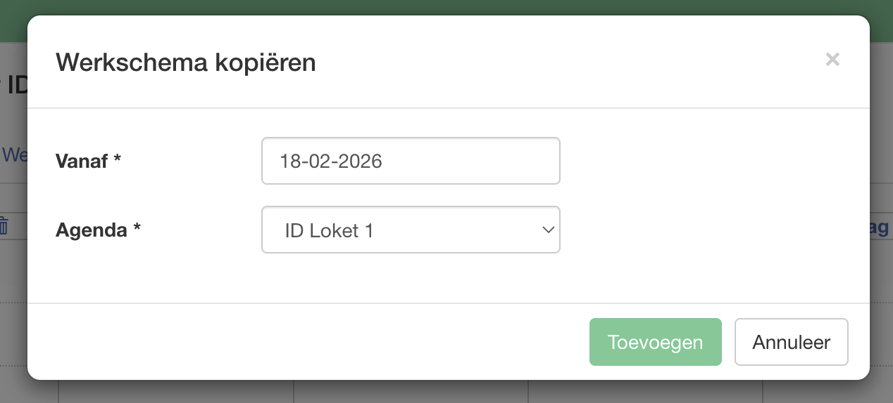

| Veld | Beschrijving |
|------|-------------|
| Vanaf | De startdatum van het nieuwe (gekopieerde) werkschema |
| Agenda | De agenda waarnaar je het werkschema kopieert |

Klik op **Toevoegen** om de kopie aan te maken. Alle weken, dagen en beschikbaarheden worden overgenomen.

---

## Werkschema verwijderen

Klik op **Verwijder** rechtsboven op de werkschema-pagina om het volledige werkschema te verwijderen.

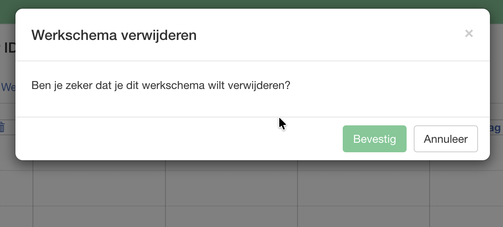

Bevestig de verwijdering door op **Bevestig** te klikken.

> Let op: het verwijderen van een werkschema heeft geen invloed op bestaande afspraken, maar maakt het wel onmogelijk om nieuwe afspraken te maken voor die agenda in de betrokken periode.

---

## Weken beheren

Een werkschema bestaat uit één of meer weken. Met meerdere weken kun je een cyclisch schema opzetten, bijvoorbeeld een week A en een week B die elkaar afwisselen.

### Week toevoegen

Klik op **+ Voeg week toe** naast de weektabs.

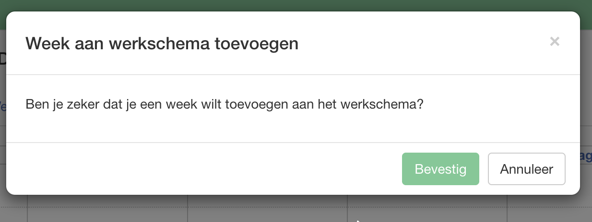

Klik op **Bevestig**. De nieuwe week wordt toegevoegd als een lege week die je daarna kunt invullen.

### Week verwijderen

Klik op het verwijder icoon naast de naam van de week (bv. naast "Week 2").

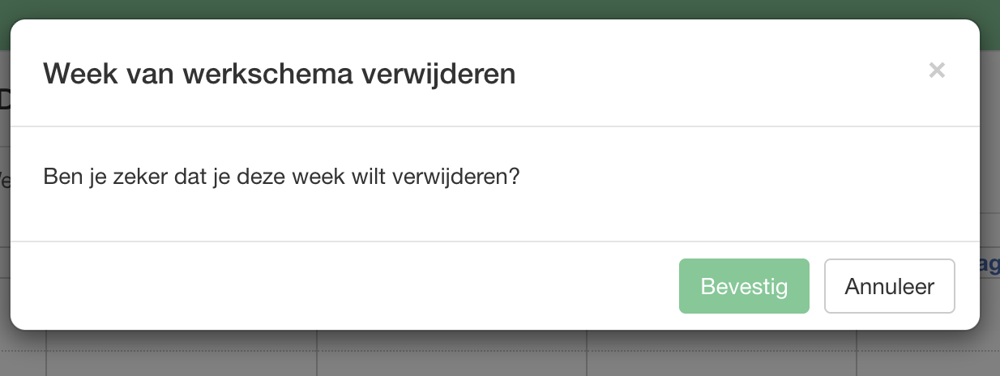

Bevestig via **Bevestig**. Alle beschikbaarheden in die week worden verwijderd.

---

## Beschikbaarheden per dag instellen

Binnen elke week stel je per dag de beschikbare tijdsloten in. Klik op een leeg tijdvak in de kalender om een beschikbaarheid toe te voegen voor dat tijdstip.

### Beschikbaarheid toevoegen

Klik op een leeg tijdvak in de kalender. Er verschijnt een popover met het gekozen tijdstip en de dag.

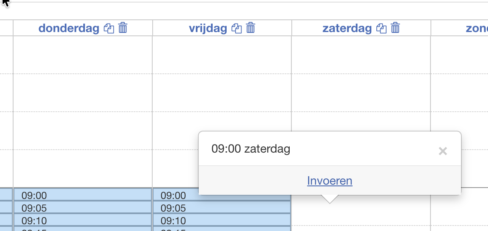

Klik op **Invoeren** om het dialoogvenster te openen.

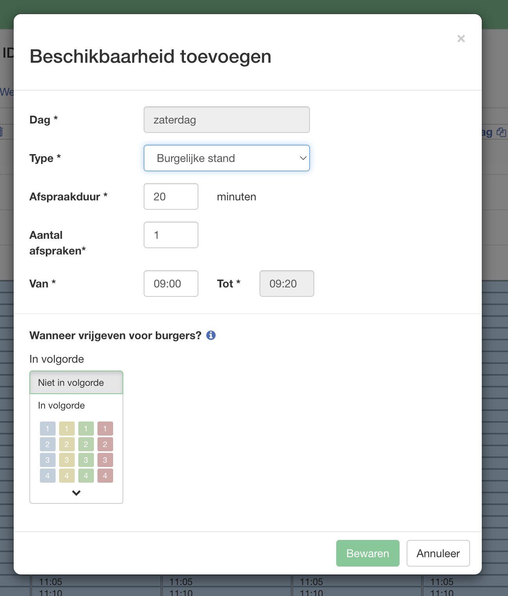

Vul de volgende velden in:

| Veld | Beschrijving |
|------|-------------|
| Dag | De dag van de week (automatisch ingevuld, niet aanpasbaar) |
| Type | Het type beschikbaarheid waarvoor de tijdsloten beschikbaar zijn |
| Afspraakduur | De duur van één slotje in minuten |
| Aantal beschikbaarheden | Het aantal sloten dat er na elkaar worden aangemaakt |
| Van / Tot | Het tijdvak waarvoor de beschikbaarheid geldt |

Klik op **Bewaren** om de beschikbaarheid op te slaan.

---

### Beschikbaarheid wijzigen

Klik op een bestaand (blauw ingekleurd) tijdvak in de kalender. Er verschijnt een popover met het tijdstip, het type afspraak en twee acties.

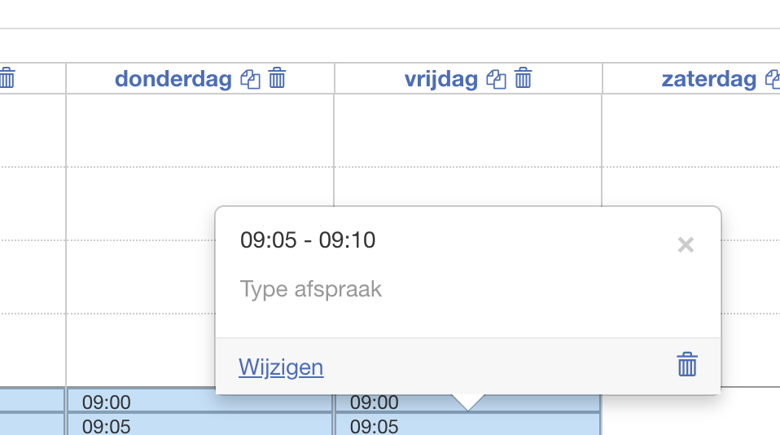

Klik op **Wijzigen** om het dialoogvenster te openen.

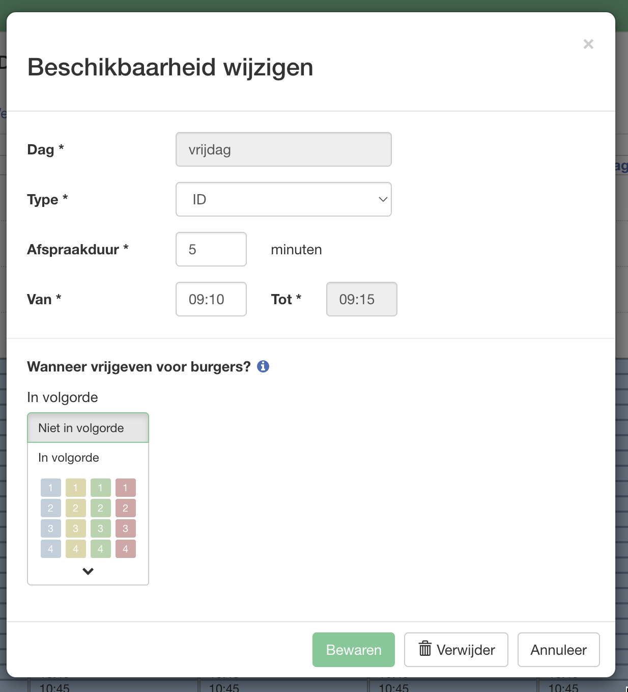

Je kunt hier hetzelfde aanpassen als bij het toevoegen. Klik op **Bewaren** om de wijzigingen op te slaan, of op **Verwijder** om deze beschikbaarheid te verwijderen.

---

## Beschikbaarheden van een dag kopiëren of verwijderen

### Dag kopiëren

Je kunt alle beschikbaarheden van één dag kopiëren naar een andere dag, agenda of werkschema. Klik op het kopieericoon naast de dagnaam in de kalenderheader.

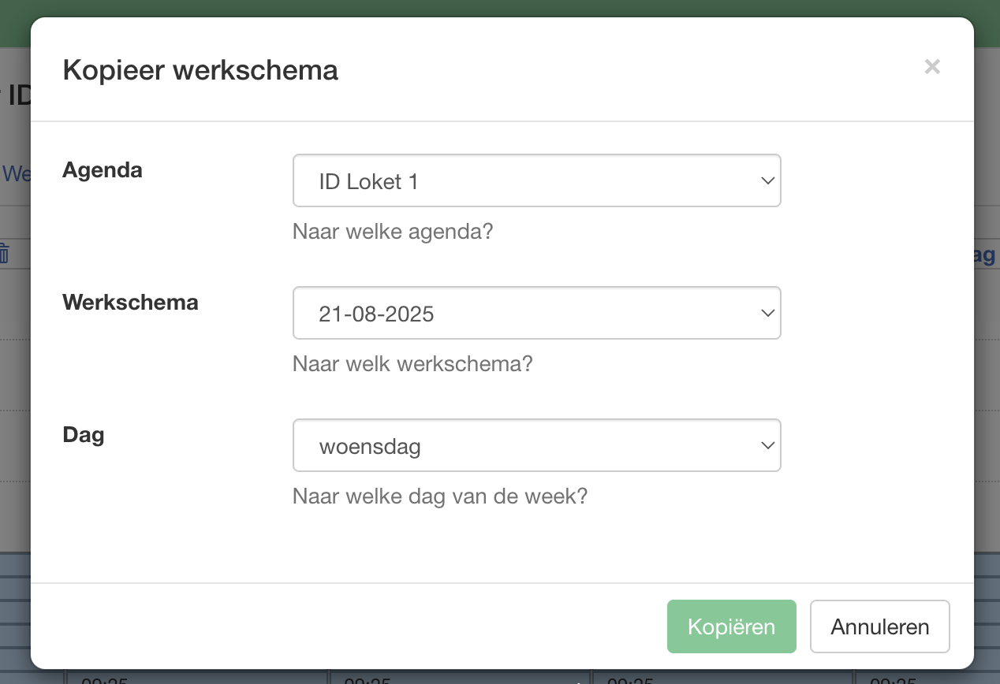

| Veld | Beschrijving |
|------|-------------|
| Agenda | De agenda waarnaar je kopieert |
| Werkschema | Het werkschema waarnaar je kopieert (op basis van startdatum) |
| Dag | De dag van de week waarop je de beschikbaarheden plakt |

Klik op **Kopiëren** om te bevestigen.

### Dag leegmaken

Klik op het verwijdericoon naast de dagnaam in de kalenderheader om alle beschikbaarheden van die dag in één keer te verwijderen.

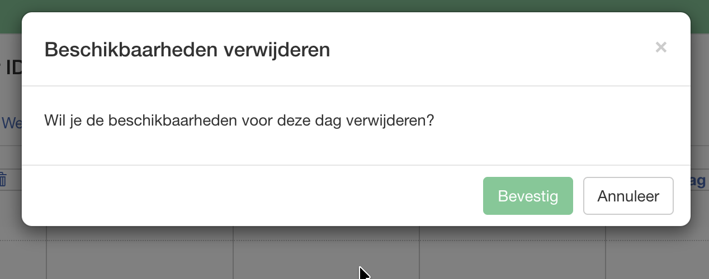

Bevestig via **Bevestig**.

---

*Laatst bijgewerkt: 18 februari 2026*
